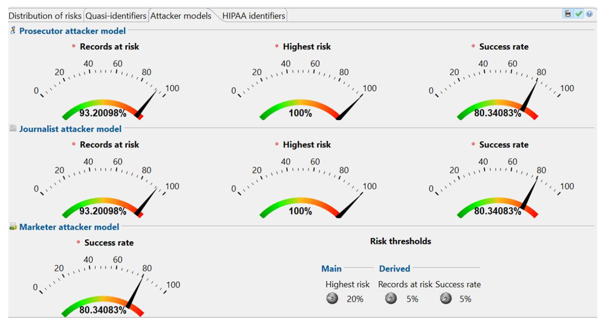
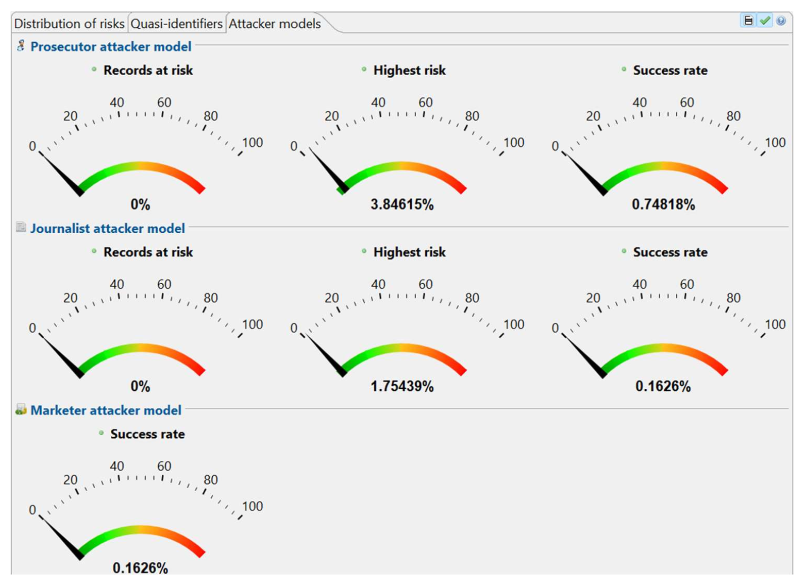
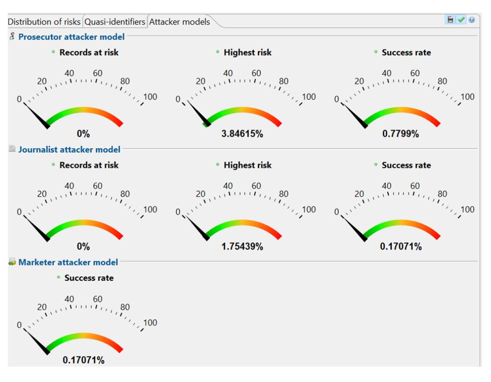
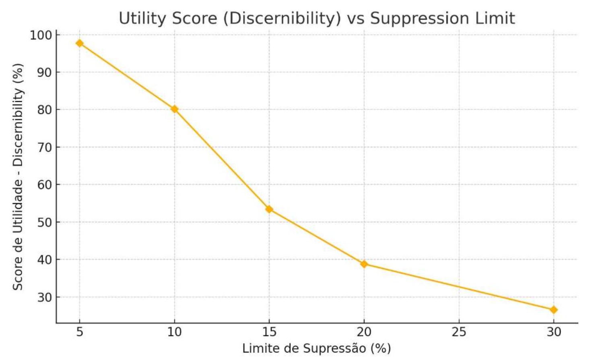
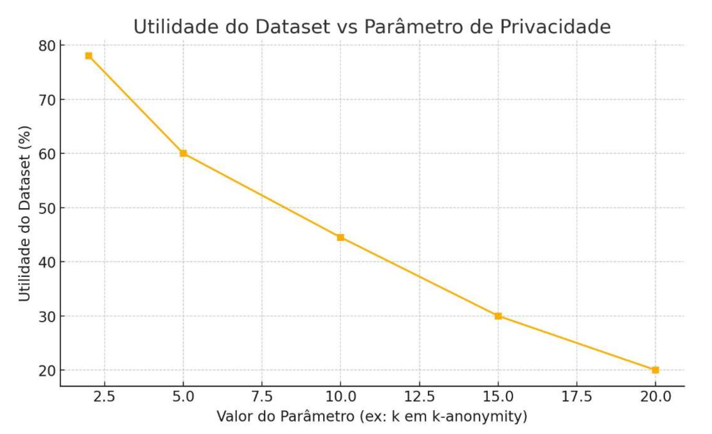
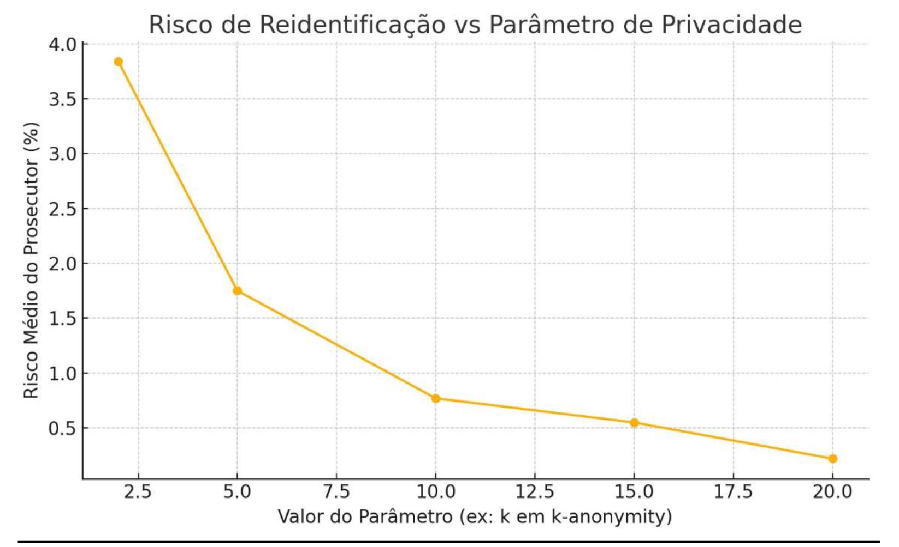

# 📊 Dataset Anonymization with ARX

This project explores **privacy-preserving data publishing** using the [ARX Data Anonymization Tool](https://arx.deidentifier.org/).  
The focus is on applying anonymization techniques such as **k-anonymity**, **ℓ-diversity**, and **t-closeness** to evaluate the trade-off between **privacy risks** and **data utility**.

---

## 🚀 Objectives
- Apply different anonymization techniques to a dataset using ARX.  
- Measure **re-identification risks** under attacker models (Prosecutor, Journalist, Marketer).  
- Evaluate **data utility** under suppression and privacy constraints.  
- Compare anonymization strategies in terms of **risk–utility trade-off**.  

---

## 📂 Repository Structure
```bash
dataset-anonymization-arx/
│
├── arx_project/            # ARX project file (.deid) to reproduce the experiments
├── reports/                # PDF reports with full analysis and discussion
├── images/                 # Key figures and visualizations from the study
│   ├── 1.png  # Risk distribution (Prosecutor/Journalist/Marketer models)
│   ├── 2.png  # High-risk scenario
│   ├── 3.png  # Alternative anonymization evaluation
│   ├── 4.png  # Utility score vs suppression limit
│   ├── 5.png  # Dataset utility vs privacy parameter (k)
│   ├── 6.png  # Re-identification risk vs privacy parameter (k)
└── LICENSE                 # License for usage
```

---

## 📊 Key Visualizations

### 🔒 Risk Assessment
- **Distribution of risks across attacker models**  


- **High-risk scenario comparison**  


- **Alternative anonymization analysis**  


---

### 📉 Utility and Suppression
- **Utility Score (Discernibility) vs Suppression Limit**  


- **Dataset Utility vs Privacy Parameter (k-anonymity)**  


- **Re-identification Risk vs Privacy Parameter (k-anonymity)**  


---

## 🛠️ How to Reproduce
1. Install [ARX Data Anonymization Tool](https://arx.deidentifier.org/).  
2. Open the project file located in `arx_project/`.  
3. Explore anonymization strategies and compare risk/utility results.  
4. Refer to the PDF in `reports/` for detailed analysis.

---

## 📑 Reports
The `reports/` folder includes the **full written report** (`Trabalho.pdf`) with methodology, results, and conclusions.  
It provides both the **theoretical framework** and the **experimental results** supporting this repository.

---

## ⚖️ Results & Insights
- Increasing **k (privacy parameter)** reduces re-identification risk but lowers utility.  
- Suppression significantly impacts data usability when thresholds exceed 15–20%.  
- Different attacker models yield different risk perceptions, reinforcing the need for balanced anonymization strategies.  

---

## 📜 License
This project is released under the MIT License.  
Feel free to explore, reuse, and adapt for academic or research purposes.

---

## 👩‍💻 Authors
Project developed as part of **Security and Privacy coursework**.  
Team members: *Ana Sofia Quintero, Catarina Abrantes, Liliana Silva*.

---
